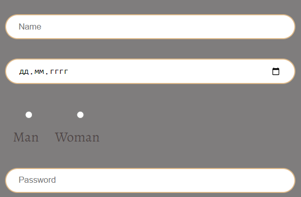
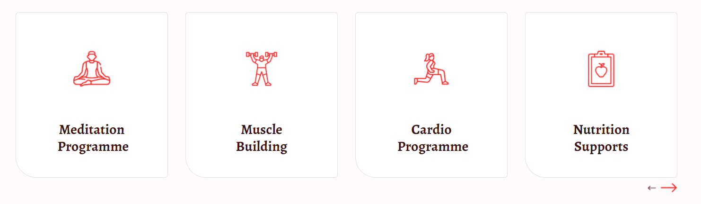

# WebJS

## 1. Header: `header.header>nav.header__nav>ul.header__list>li.header__item>a.header__link`

## 2. Form: `form.form>.form__information>.personal-info>label.personal-info__label-name`

## 3. Cards: `.cards>.card>img.card__img+h4.card__name+a.card__link`

## 4. Social-media: `.social-media>a.social-media__link>img.social-media__img--red`

