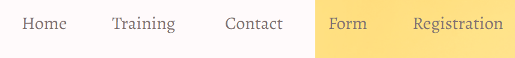
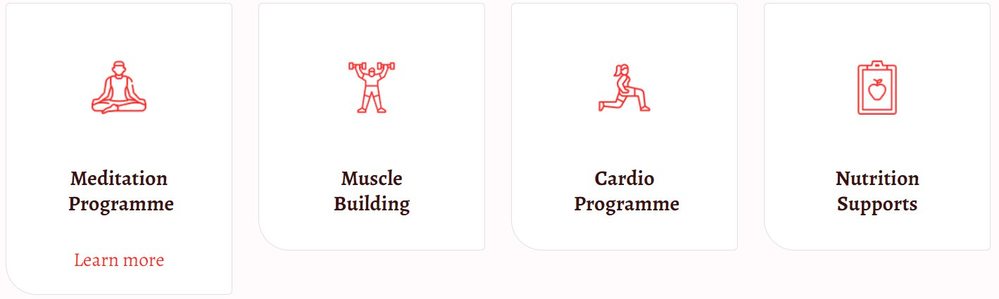
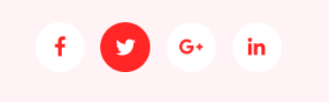

# WebJS

## 1. Header: `header.header>nav.header__nav>ul.header__list>li.header__item*5>a.header__link`

## 2. Form: `form.form>(label>input.form__email)+label>input.form__submit`

## 3. Cards: `.cards>.card*4>img.card__img+h4.card__name+a.card__link`

## 4. Social-media: `.social-media>a.social-network*4>img.social-network__img`

